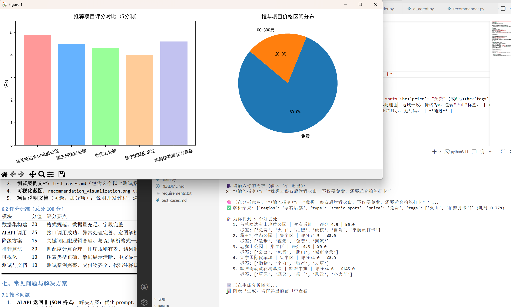
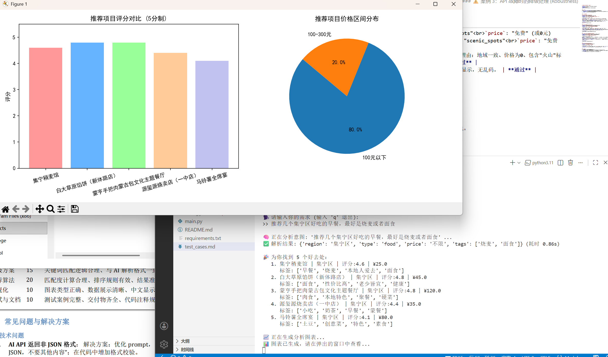
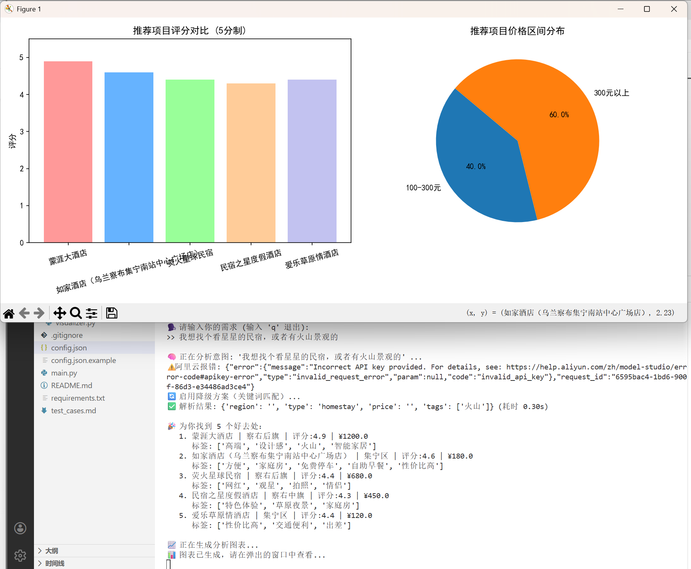

# 🌋 Smart Travel Rec | 基于大模型的本地文旅智能推荐系统

> **An Intelligent Tourism Recommendation System based on LLM & Robust Fallback Mechanisms**


## 📖 项目简介 (Introduction)

本项目是一个结合了 **LLM（大语言模型）** 语义理解能力与 **本地知识库** 的智能推荐系统。旨在解决传统旅游搜索仅依赖关键词匹配、无法理解用户复杂自然语言需求（如“想找个适合拍照的免费景点”）的痛点。

系统采用 **RAG（检索增强生成）** 的简化思路，通过 LLM 解析用户意图，结合本地构建的乌兰察布文旅数据集，利用多维加权算法为用户提供精准的个性化推荐与数据可视化分析。

## ✨ 核心亮点 (Key Features)

*   **🧠 LLM 意图识别 (LLM-based Intent Analysis)**
    *   集成 **百度文心 (Ernie Speed)** / **阿里云通义 (Qwen Turbo)** API。
    *   通过 Prompt Engineering 将非结构化自然语言转化为结构化 JSON 查询指令（提取地域、价格、标签等）。
*   **🛡️ 服务降级熔断机制 (Robustness & Fallback)**
    *   设计了高可用的异常处理逻辑。当 LLM API 发生网络波动、Token 耗尽或鉴权失败时，系统自动平滑切换至 **基于关键词规则的本地引擎**，保障服务 100% 可用。
*   **🎯 混合推荐算法 (Hybrid Recommendation)**
    *   实现了基于 `Jaccard` 标签相似度、地理位置围栏、价格区间的混合加权评分模型。
    *   引入“硬约束过滤”机制，有效剔除零匹配度的噪声数据。
*   **📊 交互式数据可视化 (Interactive Visualization)**
    *   (CLI版) 集成 `Matplotlib` 自动生成评分分布柱状图与价格区间饼图。
    *   (Web版) 基于 `Streamlit` 构建现代化交互界面，支持多轮对话与图表实时渲染。

## 🛠️ 技术栈 (Tech Stack)

*   **编程语言**: Python 3.9
*   **大模型接口**: Baidu Qianfan API / Aliyun Bailian API
*   **核心库**: 
    *   `requests`: 处理 API 网络请求
    *   `matplotlib`: 数据可视化绘制
    *   `streamlit`: Web UI 构建 (可选)
*   **数据存储**: JSON (模拟 NoSQL 文档存储)

## 📂 项目结构 (Structure)

```text
SmartTravelRec/
├── assets/                 # 项目截图与静态资源
├── data/
│   └── tourism_data.json   # 本地文旅知识库（经过人工校验）
├── src/
│   ├── ai_agent.py         # AI 意图解析与降级策略实现
│   ├── data_loader.py      # 数据加载与预处理
│   ├── recommender.py      # 推荐算法核心逻辑
│   └── visualizer.py       # 可视化绘图模块
├── app.py                  # Streamlit Web 应用入口
├── main.py                 # CLI 命令行入口
├── config.json.example     # API 密钥配置模板（安全脱敏）
├── requirements.txt        # 项目依赖清单
└── README.md               # 项目说明文档
```

## 🚀 快速开始 (Quick Start)

### 1. 环境准备
```bash
# 克隆项目
git clone https://github.com/YourUsername/SmartTravelRec.git
cd SmartTravelRec

# 安装依赖
pip install -r requirements.txt
```

### 2. 配置密钥
本项目出于安全考虑，未上传真实密钥。请将 `config.json.example` 重命名为 `config.json` 并填入你的 Key：

```json
{
  "baidu_api": {
    "api_key": "YOUR_BAIDU_API_KEY",
    "secret_key": "YOUR_BAIDU_SECRET_KEY"
  },
  "ali_api": {
    "api_key": "YOUR_ALIYUN_API_KEY"
  }
}
```

### 3. 运行系统

**方式 A：命令行模式 (CLI)**
```bash
python main.py
```

**方式 B：Web 网页模式 (推荐)**
```bash
streamlit run app.py
```

## 📸 系统演示 (Screenshots)

### 1. 复杂意图理解与推荐
> 用户输入：“我想去察右后旗看火山，不仅要免费，还要适合拍照打卡”




### 2. Web 可视化交互界面
> Streamlit 界面展示




### 3. 服务降级（断网测试）
> 模拟 API 失效，系统自动降级为关键词匹配模式




## 🔍 数据构建说明 (Data Construction)

本项目数据来源于 **大众点评** 与 **携程** 公开数据的整理与清洗。
*   范围：内蒙古乌兰察布市（包含集宁区、察右后旗、兴和县等）。
*   规模：30条精选数据，涵盖 `scenic_spots` (景点), `food` (美食), `homestay` (民宿)。
*   清洗：人工校验了 `score` (评分) 与 `price` (人均/门票) 的时效性。

## 📝 待优化方向 (Future Work)

*   [ ] 引入 `SQLite` 或 `MySQL` 替换 JSON 文件，支持更大规模数据存储。
*   [ ] 引入 `Sentence-BERT` 模型，将基于标签的匹配升级为 **向量语义检索 (Vector Search)**。
*   [ ] 增加用户反馈机制 (RLHF)，根据用户点击优化推荐权重。

---

*Created by 侯静原 | 2026*
```
